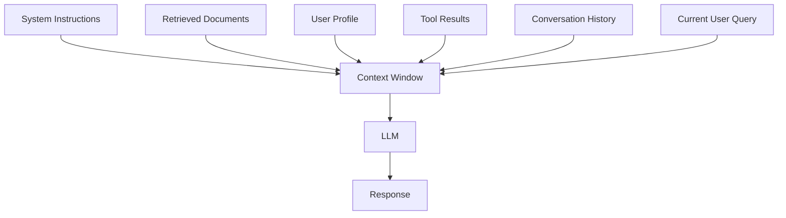
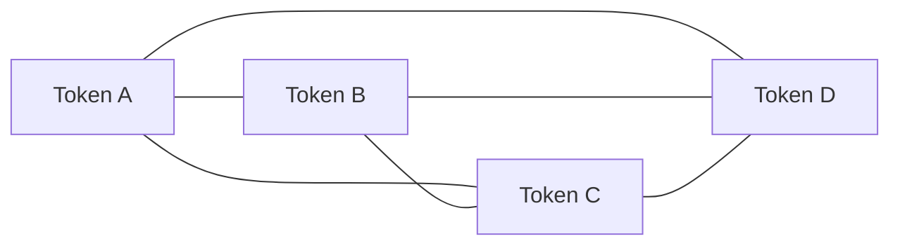
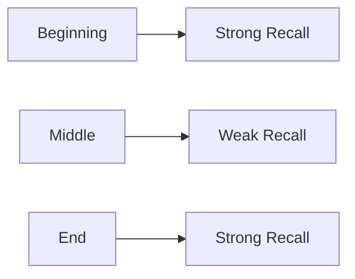
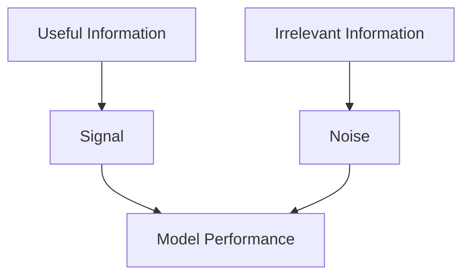
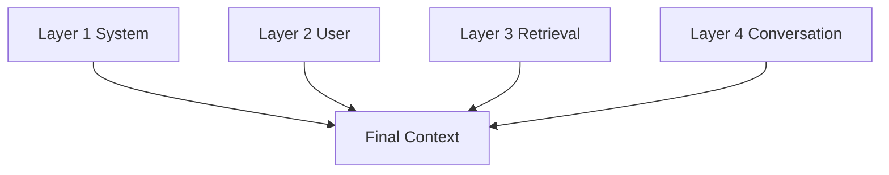
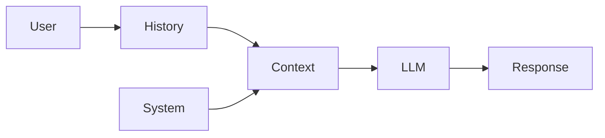
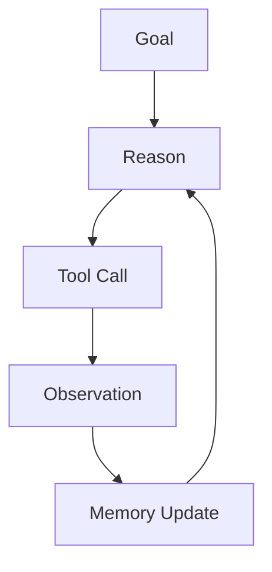
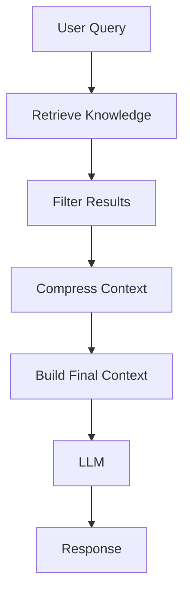

# Chapter 01 — Foundations of Context Engineering

## Learning Objectives

By the end of this chapter, you should be able to:

* Define Context Engineering
* Differentiate Context Engineering from Prompt Engineering
* Understand how LLM Context Windows work
* Explain why context is often the primary bottleneck in AI systems
* Distinguish between Static and Dynamic Context
* Understand context requirements for Chat Systems and Agentic Systems
* Design simple context pipelines
* Identify common context engineering failures

---

# Table of Contents

1. Introduction
2. What is Context Engineering?
3. Context Engineering vs Prompt Engineering
4. Understanding the LLM Context Window
5. Why Context is the Real Bottleneck
6. Static vs Dynamic Context
7. Context in Chat Systems
8. Context in Agentic Systems
9. Common Context Engineering Failures
10. Mental Models for Context Engineering
11. Practical Context Engineering Workflow
12. Key Takeaways
13. Revision Sheet
14. Interview Questions
15. Further Reading

---

# 1. Introduction

Large Language Models are often perceived as intelligent systems capable of solving a wide range of problems. However, in production systems, the limiting factor is rarely the model itself.

Most failures occur because:

* The model lacks required information.
* The model receives too much irrelevant information.
* Important information is badly formatted.
* Critical facts are buried inside huge contexts.

This realization has led to a new discipline:

> Context Engineering

Context Engineering is becoming one of the most important skills in modern AI engineering, particularly for:

* Retrieval-Augmented Generation (RAG)
* Agentic Systems
* Multi-Agent Architectures
* AI Assistants
* Long-Context Applications
* Enterprise AI Systems

---

# 2. What is Context Engineering?

## Definition

Context Engineering is the discipline of deciding:

* What information enters the context window
* What information stays outside
* How information is organized
* How information is compressed
* When information should be injected

to maximize model performance.

---

## The Brilliant Consultant Analogy

Imagine hiring a consultant with:

* Genius-level intelligence
* Perfect reasoning
* No memory

Every morning:

```text
Memory Reset
```

To make them useful, you must provide a folder containing:

```text
Instructions
Relevant Documents
Current Task
Past Work
Important Constraints
```

The consultant represents the LLM.

The folder represents the context.

Context Engineering is the process of constructing the folder.

---

## The Real Input to an LLM

Most people think:

```text
User Prompt → LLM → Response
```

Reality looks more like:



The user query is often the smallest component.

The majority of the information is engineered by the system.

---

## Why It Is Called Engineering

Prompt Engineering focuses on wording.

Context Engineering focuses on systems.

Examples:

* Retrieval Pipelines
* Memory Management
* Context Compression
* Tool Integration
* State Management
* Agent Memory Systems

This is why modern AI applications require context engineers rather than merely prompt writers.

---

# 3. Context Engineering vs Prompt Engineering

Many beginners confuse these concepts.

---

## Prompt Engineering

Prompt Engineering focuses on:

> How to ask.

Example:

```text
Summarize this document in three bullet points.
```

The focus is instruction quality.

---

## Context Engineering

Context Engineering focuses on:

> What information is available when the question is asked.

Example:

```text
Which document?
Which version?
Which user?
Which conversation history?
Which retrieved knowledge?
```

The focus is information architecture.

---

## Comparison Table

| Prompt Engineering | Context Engineering |
| ------------------ | ------------------- |
| Instruction Design | Information Design  |
| Single Message     | Entire Pipeline     |
| Mostly Static      | Mostly Dynamic      |
| Human-Written      | System-Built        |
| Easier to Learn    | Harder to Master    |
| Tactical           | Strategic           |

---

## Why Context Matters More

Suppose a user asks:

```text
Summarize the latest refund policy.
```

Prompt Engineering decides:

```text
Summarize in 3 bullets.
Use simple language.
```

Context Engineering decides:

```text
Which refund policy?
Latest version?
EU or US policy?
Recent change log?
```

Even a perfect prompt cannot save incorrect context.

---

## Rule of Thumb

```text
Bad Prompt + Good Context = Often Works

Good Prompt + Bad Context = Usually Fails
```

---

# 4. Understanding the LLM Context Window

## Definition

The Context Window is:

> The total amount of information visible to the model during a single inference.

Anything outside the context window does not exist for the model.

---

## Context Window Mental Model

Think of it as RAM.

```text
Computer RAM ≈ LLM Context Window
```

Programs cannot access data outside RAM.

Similarly:

```text
Models cannot reason about information outside the context window.
```

---

## Tokens, Not Words

Models process tokens rather than words.

Approximation:

```text
1 token ≈ 0.75 English words
```

Examples:

```text
hello      → 1 token
context    → 1 token
engineering → 1 token
```

Code and JSON consume tokens rapidly.

---

## Attention Mechanism

Transformers use Attention.

Each token examines other tokens to determine relevance.

Simplified:



This interaction creates understanding.

---

## Lost-in-the-Middle Problem

Research has shown:

Information at the beginning receives more attention.

Information at the end receives more attention.

Information in the middle often receives less attention.



---

## Consequences

Injecting a 300-page document can reduce quality because:

* More noise
* More distractions
* More retrieval errors

Large context windows do not eliminate context engineering.

---

# 5. Why Context is the Real Bottleneck

Most people focus on model intelligence.

Production systems reveal a different reality.

```text
Model Quality × Context Quality
```

Even the best model fails with poor context.

---

## Four Context Failure Modes

### 1. Missing Context

The model lacks required information.

Result:

```text
Hallucinations
```

---

### 2. Excess Noise

The model receives irrelevant information.

Result:

```text
Confusion
```

---

### 3. Wrong Format

Information exists but is poorly organized.

Result:

```text
Misinterpretation
```

---

### 4. Wrong Position

Important information is buried.

Result:

```text
Lost-in-the-middle failures
```

---

## Signal vs Noise

A useful framework:

```text
Performance ∝ Signal / Noise
```

Goal:

```text
Increase Signal
Decrease Noise
```

Visualization:



---

# 6. Static vs Dynamic Context

Every context component belongs to one of two categories.

---

## Static Context

Rarely changes.

Examples:

* System Prompt
* Company Policies
* Safety Instructions
* Output Formats
* Few-Shot Examples

---

## Dynamic Context

Changes continuously.

Examples:

* User Profile
* Conversation History
* Retrieved Chunks
* Tool Outputs
* Current State

---

## Four-Layer Context Model



---

### Layer 1 — System

Contains:

* Instructions
* Persona
* Guardrails

Changes infrequently.

---

### Layer 2 — User

Contains:

* Preferences
* Profile
* Permissions

Changes per user.

---

### Layer 3 — Retrieval

Contains:

* Retrieved Documents
* Knowledge Base Results
* Search Results

Changes per query.

---

### Layer 4 — Conversation

Contains:

* Recent Messages
* Working Memory
* Current Task State

Changes every turn.

---

# 7. Context in Chat Systems

Traditional chat systems require:

```text
System Prompt
Conversation History
Current User Query
```

Architecture:



Challenges:

* Long conversations
* Token limits
* Memory pruning

---

# 8. Context in Agentic Systems

Agentic Systems are significantly more complex.

Additional requirements:

* Goal State
* Plans
* Tool Results
* Working Memory
* Constraints
* Observations

---

## Agent Loop



---

## Agent Context Explosion

Every iteration generates:

* Thoughts
* Plans
* Tool Outputs
* Observations

Context grows rapidly.

Without compression:

```text
Agent Failure
```

---

## Agent Context Challenges

### Context Bloat

Too many tool results.

### Goal Drift

Agent forgets original objective.

### State Tracking

Agent loses important information.

### Memory Management

Old context must be summarized.

---

# 9. Common Context Engineering Failures

## Failure #1

Injecting entire databases.

---

## Failure #2

Injecting complete conversation history.

---

## Failure #3

Ignoring retrieval quality.

---

## Failure #4

Poor chunking strategies.

---

## Failure #5

No token budgeting.

---

## Failure #6

Poor formatting.

---

## Failure #7

No context compression.

---

## Failure #8

Sending identical context to all agents.

---

# 10. Mental Models for Context Engineering

---

## The Folder Model

```text
LLM = Brilliant Consultant

Context = Folder
```

Your job:

```text
Build the best folder possible.
```

---

## The Radio Model

```text
Signal / Noise
```

High signal:

```text
Great Performance
```

High noise:

```text
Poor Performance
```

---

## The RAM Model

```text
Context Window = RAM
```

More RAM does not mean:

```text
Load Everything
```

It means:

```text
Manage Memory Better
```

---

## The Librarian Model

Context Engineering is similar to:

```text
Finding the right book
Finding the right chapter
Finding the right page
Finding the right paragraph
```

instead of dumping the entire library.

---

# 11. Practical Context Engineering Workflow



---

# 12. Key Takeaways

1. Context Engineering is information architecture for LLMs.
2. Context often matters more than prompts.
3. The context window is finite.
4. Bigger windows do not eliminate context engineering.
5. Signal-to-noise ratio is critical.
6. Retrieval quality directly impacts performance.
7. Agentic systems require active context management.
8. Context compression is a core skill.
9. Multi-agent systems require context routing.
10. Context is the primary bottleneck in modern AI systems.

---

# 13. Revision Sheet

### Context Engineering

Designing what information enters the model.

### Prompt Engineering

Designing how instructions are written.

### Context Window

Information visible during inference.

### Lost-in-the-Middle

Middle-position information receives less attention.

### Static Context

Rarely changing information.

### Dynamic Context

Request-specific information.

### Signal

Useful information.

### Noise

Irrelevant information.

### Goal

Maximize Signal. Minimize Noise.

---

# 14. Interview Questions

## Beginner

1. What is Context Engineering?
2. How is it different from Prompt Engineering?
3. What is a Context Window?
4. What is a token?

---

## Intermediate

5. Explain Lost-in-the-Middle.
6. Why can more context reduce performance?
7. Explain the four context failure modes.
8. What is the signal-to-noise ratio?

---

## Advanced

9. Design a context pipeline for a RAG system.
10. Design a memory architecture for an AI agent.
11. How would you handle context compression?
12. How would you manage context in a multi-agent system?
13. How would you evaluate context quality?

---

# 15. Further Reading

Recommended next chapter:

```text
Chapter 02 — Context Window Mechanics
```

Topics to cover next:

* Tokenization Internals
* Attention Mechanism Deep Dive
* Positional Encoding
* Primacy and Recency Bias
* Lost-in-the-Middle Research
* Token Budgeting
* Context Packing
* Context Ordering Strategies
* Long Context Models
* Attention Sinks
* KV Cache
* Inference Optimization

This chapter forms the foundation for all advanced Context Engineering concepts including RAG, Memory Systems, Agentic AI, and Multi-Agent Architectures.
