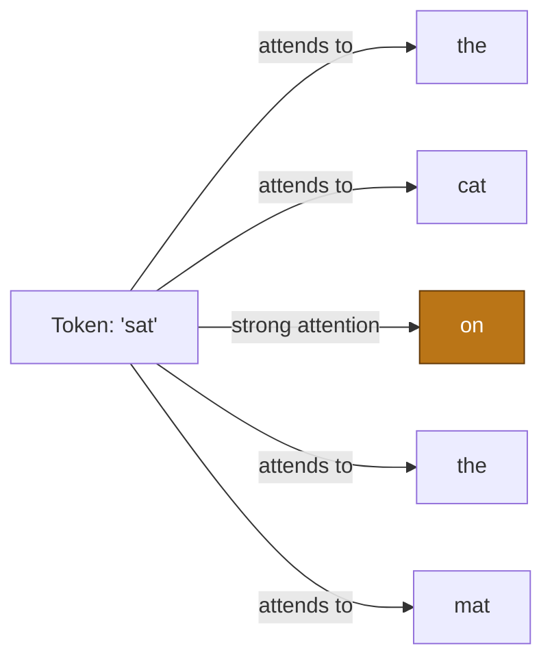
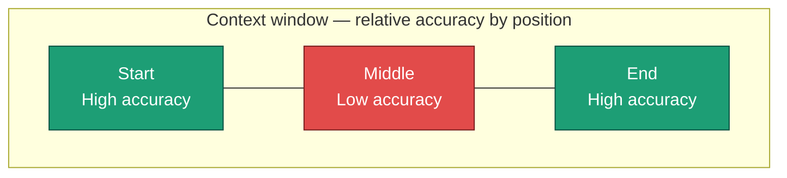
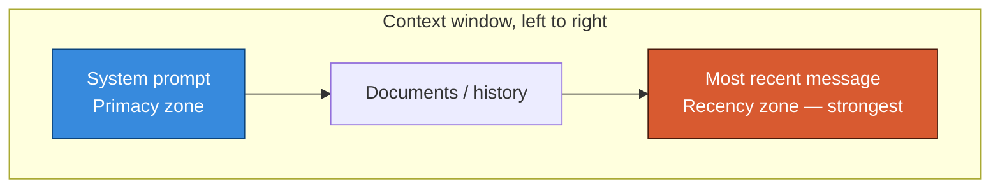
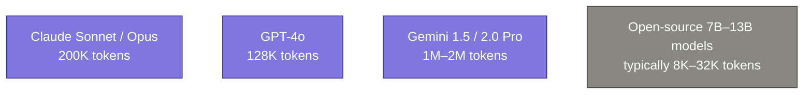
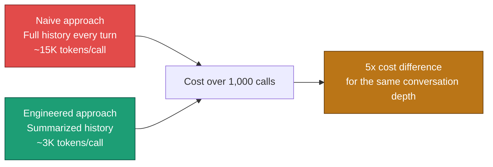
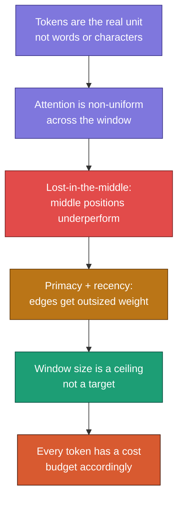

# Topic 02 — Context Window Mechanics

> Part of the Context Engineering curriculum. Topic 02 of 8.

---

## Table of Contents

1. [Tokens — The Real Unit of Context](#1-tokens--the-real-unit-of-context)
2. [How Models Read the Context Window](#2-how-models-read-the-context-window)
3. [The "Lost in the Middle" Phenomenon](#3-the-lost-in-the-middle-phenomenon)
4. [Primacy & Recency Effects](#4-primacy--recency-effects)
5. [Context Window Sizes Across Models](#5-context-window-sizes-across-models)
6. [Token Counting and Cost Estimation](#6-token-counting-and-cost-estimation)
7. [Summary](#7-summary)

---

## 1. Tokens — The Real Unit of Context

### Core idea

LLMs do not see words, characters, or sentences. They see **tokens** — sub-word units produced by a tokenizer. Context engineering is fundamentally about managing a **token budget**, not a word count or character count.

A token is roughly 4 characters or ~0.75 words in English, but this is only an average. Rare words, code, JSON, and non-English text all tokenize less efficiently.

```text
"hello"           → 1 token
"context"         → 1 token
"engineering"     → 1 token
"Peshawar"        → 2–3 tokens   (uncommon proper noun)
"{'key': 'val'}"  → 6 tokens     (punctuation-heavy, expensive)
"the the the"     → 3 tokens     (repetition doesn't compress)
```

### Why this matters

If you estimate your context size in "words" you will consistently underestimate your real token usage — especially for code, structured data (JSON/XML), and non-English content. This causes silent truncation or unexpected API errors in production.

### Code: always count, never estimate

```python
import anthropic

client = anthropic.Anthropic()

def get_token_count(system_prompt: str, messages: list) -> int:
    """Always measure tokens before sending — don't guess from word count."""
    response = client.messages.count_tokens(
        model="claude-sonnet-4-20250514",
        system=system_prompt,
        messages=messages
    )
    return response.input_tokens

usage = get_token_count(
    system_prompt="You are a helpful assistant.",
    messages=[{"role": "user", "content": "Explain quantum entanglement."}]
)
print(f"Tokens used: {usage}")
```

### Common mistake

> "My context is about 5,000 words, so it should be roughly 5,000 tokens."

Wrong on two counts: words ≠ tokens (tokens are usually ~33% *more* than word count for English prose), and this ratio breaks down badly for code or structured data, where token count can be 2–3x the word count.

### ✅ Check question

A 10-page PDF has roughly 4,000 words of prose plus a 200-row JSON table appended at the end. Why might your token count come back much higher than `4,000 / 0.75 ≈ 5,300` tokens? What's the missing piece?

---

## 2. How Models Read the Context Window

### Core idea

A transformer model does not read context sequentially the way a human reads a book. Every token uses a mechanism called **self-attention** to look at every other token in the window simultaneously and decide how much weight to give it.

This has a critical consequence: **the model "sees" the entire window at once, but it does not weigh every position equally.** Attention is not uniform — and that non-uniformity is the root cause of most context engineering bugs.



Every token attends to every other token — but the *strength* of that attention varies, and that variation is shaped by position, relevance, and training patterns.

### Why this matters for context engineering

Because attention isn't uniform, **where** you place information in the context window changes how strongly the model uses it — independent of how *important* that information actually is. This means two context windows with identical content but different ordering can produce different quality answers.

### Code: a simplified mental simulation

```python
def simplified_attention_weight(position: int, total_length: int) -> float:
    """
    NOT a real attention formula — a simplified illustration of the
    empirical pattern: positions near the start and end get more
    effective attention than positions in the middle.
    """
    relative_pos = position / total_length
    # U-shaped curve: high at edges, low in the middle
    weight = 1 - 4 * relative_pos * (1 - relative_pos)
    return round(weight, 2)

for pos in [0, 25, 50, 75, 99]:
    w = simplified_attention_weight(pos, 100)
    print(f"Position {pos:3d}/100 → relative effective weight: {w}")
```

```text
Position   0/100 → relative effective weight: 1.0
Position  25/100 → relative effective weight: 0.75
Position  50/100 → relative effective weight: 0.5
Position  75/100 → relative effective weight: 0.75
Position  99/100 → relative effective weight: 1.0
```

This is illustrative, not the literal math transformers use — but it captures the empirically observed U-shape that researchers have measured in real models.

### Common mistake

> "If I put it in the context window, the model will use it correctly regardless of where I put it."

The model can technically access any token in the window, but *accessing* and *effectively using* are different things. Position affects usage even when the information itself doesn't change.

### ✅ Check question

If attention is roughly U-shaped across the context window, where would you place: (a) your most critical instruction, and (b) a long reference document that's mostly supporting detail? Why?

---

## 3. The "Lost in the Middle" Phenomenon

### Core idea

This is a well-documented empirical finding (originating from a 2023 Stanford/UC Berkeley study, *"Lost in the Middle: How Language Models Use Long Contexts"*): when relevant information is placed in the **middle** of a long context window, model performance on retrieving and using that information drops significantly compared to placing it at the **start** or **end**.



### Concrete example

Imagine a RAG system retrieves 10 document chunks for a question, and the single correct answer lives in chunk #5 (dead center). Studies show models answer this correctly far less often than when the same chunk is placed first or last in the list — even though nothing about the chunk's content changed.

### Why this happens

Researchers believe this connects to training data patterns — most training documents have their most important information at the beginning (titles, abstracts, topic sentences) or reinforced at the end (conclusions, summaries). Models learn this bias and carry it into inference, regardless of the actual content's structure.

### Code: a re-ranking strategy that exploits this

```python
def reorder_for_lost_in_middle(ranked_chunks: list[str]) -> list[str]:
    """
    Given chunks ranked by relevance (most relevant first),
    reorder them so the MOST relevant chunks land at the start
    AND end of the context window — not buried in the middle.
    """
    n = len(ranked_chunks)
    result = [None] * n
    left, right = 0, n - 1

    for i, chunk in enumerate(ranked_chunks):
        if i % 2 == 0:
            result[left] = chunk
            left += 1
        else:
            result[right] = chunk
            right -= 1

    return result

# Example: chunks ranked by relevance, chunk[0] is most relevant
chunks = ["most_relevant", "2nd", "3rd", "4th", "least_relevant"]
reordered = reorder_for_lost_in_middle(chunks)
print(reordered)
# ['most_relevant', '4th', '3rd', '2nd', 'least_relevant']
# Most relevant content is now at both edges, weakest is buried
```

### Common mistake

> "I'll just sort my retrieved chunks by relevance score, most relevant first, and feed them in that order."

This puts your *second* most relevant chunk in a relatively strong position, but your 4th, 5th, and 6th most relevant chunks — which might still contain the answer — end up in the worst possible position: the dead middle. Deliberate reordering (like the zig-zag pattern above) often outperforms naive relevance-sorted order.

### ✅ Check question

You have 8 retrieved chunks for a question, ranked by relevance score from a re-ranker. Using the zig-zag reordering strategy above, which position (1st, 2nd, 3rd... 8th in the final order) would the **3rd most relevant** chunk end up in?

---

## 4. Primacy & Recency Effects

### Core idea

Primacy and recency are well-known cognitive science terms borrowed for LLM behavior:

- **Primacy effect** — information at the *start* of the context is remembered/weighted more strongly.
- **Recency effect** — information at the *end* of the context (closest to the generation point) is weighted more strongly.

This is closely related to "lost in the middle" (Subtopic 3) but is worth treating separately because it specifically explains *why* the two edges behave differently, not just that the middle is weak.



### Why recency is usually stronger than primacy

The token immediately before generation begins has an outsized influence — the model is, in a sense, "about to speak" and the most recent tokens are structurally closest to that act. This is why the **last user message** in a chat almost always dominates the response, even if it contradicts something stated earlier in the system prompt.

### Concrete example

```text
System prompt (start of context):
"Always respond in French."

... 40 turns of conversation later ...

User's final message (end of context):
"Please answer in English from now on."

Result: the model usually obeys the LATEST instruction (English),
even though the system prompt said French — because recency
effects give the most recent instruction outsized weight.
```

This is exactly why production systems re-inject critical system-level instructions periodically in long conversations, rather than relying on them staying "sticky" from message 1.

### Code: re-injecting critical instructions to fight recency drift

```python
def inject_periodic_reminder(messages: list, reminder: str, every_n_turns: int = 10) -> list:
    """
    Combat recency drift by re-injecting a critical instruction
    every N turns, instead of relying on it persisting from the
    original system prompt alone.
    """
    turn_count = len([m for m in messages if m["role"] == "user"])

    if turn_count > 0 and turn_count % every_n_turns == 0:
        messages.append({
            "role": "system",
            "content": f"[Reminder] {reminder}"
        })

    return messages

messages = inject_periodic_reminder(
    messages,
    reminder="Always cite sources using [n] notation.",
    every_n_turns=10
)
```

### Common mistake

> "I stated the rule once in the system prompt, that should hold for the entire conversation."

In short conversations, this mostly works. In long-running agentic loops or extended chats, recency effects mean later content — including a user casually contradicting an earlier rule — can override the original instruction. Critical rules need periodic reinforcement in long contexts.

### ✅ Check question

In an agentic loop running 30 steps, where would you place a reminder of the original task goal to make sure the agent doesn't drift — only at step 1, or somewhere else too? Justify your answer using primacy/recency.

---

## 5. Context Window Sizes Across Models

### Core idea

The context window is a hard ceiling — not a target. Knowing the actual limits across model families is essential for budgeting, but bigger does not mean "problem solved."



> **Note:** These figures shift frequently as providers ship new models. Always check current provider documentation before designing production budgets — treat the numbers above as illustrative, not as a permanent reference.

### Why bigger windows don't eliminate the need for context engineering

1. **Cost scales with tokens.** A 1M token context costs proportionally more per call than a 10K token one, even if both fit.
2. **Latency scales with tokens.** Larger contexts take measurably longer to process before the first output token appears.
3. **Lost-in-the-middle gets worse, not better, at scale.** A 1M token window has a much bigger "middle" for things to get lost in.
4. **Noise compounds.** A bigger window invites the temptation to dump more irrelevant content in — which directly degrades output quality (see Topic 01, Subtopic 4).

### Code: dynamic budget allocation based on model

```python
MODEL_LIMITS = {
    "claude-sonnet-4-20250514": 200_000,
    "gpt-4o": 128_000,
    "gemini-1.5-pro": 1_000_000,
}

def allocate_budget(model: str, reserve_for_output: int = 4000) -> dict:
    """Allocate token budget across context layers based on model limit."""
    total = MODEL_LIMITS[model] - reserve_for_output

    return {
        "system":       min(1000, int(total * 0.02)),
        "user_profile": min(500,  int(total * 0.01)),
        "retrieved":    int(total * 0.60),   # the biggest, most variable slice
        "history":      int(total * 0.25),
        "buffer":       int(total * 0.12),   # safety margin
    }

budget = allocate_budget("claude-sonnet-4-20250514")
print(budget)
```

### Common mistake

> "Gemini has a 1M token window, so I'll just stop worrying about context engineering for that model."

Large windows are a relief valve, not a replacement for discipline. Many teams that move to large-context models see *worse* real-world performance because they stop curating context altogether and start dumping raw data — exactly the noise problem from Topic 01 Subtopic 4, just at a bigger scale.

### ✅ Check question

If cost and latency both scale with token count, and lost-in-the-middle gets worse at scale, what is the actual benefit of a 1M token context window? When would you legitimately want to use most of it?

---

## 6. Token Counting and Cost Estimation

### Core idea

Tokens aren't just a technical limit — they're a direct cost driver. Every context engineering decision (what to include, how much history to keep, how verbose your retrieved chunks are) has a dollar cost attached, multiplied across every single API call your system makes.

### The cost formula

```text
Cost per request = (input_tokens × input_price_per_token)
                  + (output_tokens × output_price_per_token)

Total cost = Cost per request × number of requests
```

Input and output tokens are usually priced differently (output is typically more expensive per token than input).

### Concrete example



### Code: a cost estimator you'd actually use

```python
PRICING = {
    "claude-sonnet-4-20250514": {
        "input_per_1m":  3.00,   # USD per 1M input tokens
        "output_per_1m": 15.00,  # USD per 1M output tokens
    }
}

def estimate_cost(model: str, input_tokens: int, output_tokens: int) -> float:
    rates = PRICING[model]
    cost = (
        (input_tokens / 1_000_000) * rates["input_per_1m"] +
        (output_tokens / 1_000_000) * rates["output_per_1m"]
    )
    return round(cost, 4)

def estimate_monthly_cost(calls_per_day: int, avg_input: int, avg_output: int, model: str) -> float:
    per_call = estimate_cost(model, avg_input, avg_output)
    return round(per_call * calls_per_day * 30, 2)

# Compare naive vs engineered context strategies at scale
naive_monthly = estimate_monthly_cost(
    calls_per_day=10_000, avg_input=15_000, avg_output=500,
    model="claude-sonnet-4-20250514"
)
engineered_monthly = estimate_monthly_cost(
    calls_per_day=10_000, avg_input=3_000, avg_output=500,
    model="claude-sonnet-4-20250514"
)

print(f"Naive context strategy:      ${naive_monthly:,.2f} / month")
print(f"Engineered context strategy: ${engineered_monthly:,.2f} / month")
print(f"Savings:                     ${naive_monthly - engineered_monthly:,.2f} / month")
```

```text
Naive context strategy:      $4,725.00 / month
Engineered context strategy: $972.00 / month
Savings:                      $3,753.00 / month
```

> Pricing figures above are illustrative placeholders for the exercise — always check current provider pricing pages before using real numbers in production planning, since prices change.

### Common mistake

> "Token cost is a finance problem, not an engineering problem — I'll let that be someone else's concern."

In production AI systems, context engineering decisions directly determine unit economics. An engineer who casually keeps full conversation history "to be safe" instead of summarizing it can singlehandedly 5x a company's inference bill. This is a core engineering responsibility, not an afterthought.

### ✅ Check question

If output tokens cost 5x more than input tokens (a common ratio), and you're building a system that summarizes long documents, what does this pricing asymmetry suggest about how you should design your summarization prompts?

---

## 7. Summary



| Subtopic | Core takeaway |
|---|---|
| Tokens | The real budget unit; word counts mislead, especially for code/JSON |
| How models read context | Attention is non-uniform; position affects effective usage independent of content importance |
| Lost in the middle | Relevant info buried mid-context is used less reliably — reorder deliberately |
| Primacy & recency | Start and end of context get outsized weight; reinforce critical rules periodically in long contexts |
| Window sizes | A ceiling, not a target; bigger windows raise cost, latency, and noise risk |
| Token cost | Every context decision has a direct dollar cost multiplied across all requests |

**Next up: Topic 03 — Information Selection & Filtering**, where we go deep on relevance scoring, re-ranking, and deciding what actually earns a place in the context window.
